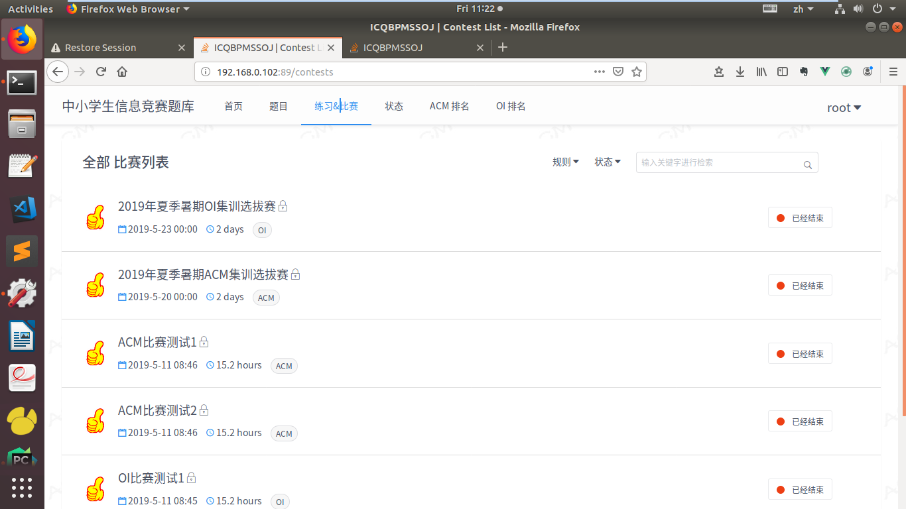

# 中小学生信息竞赛题库系统

## 1、系统实现的平台
本项目使用的平台是Linux，原因是很多开源项目和源程序代码和Linux结合的很好。项目选择的Python具有丰富的库，是跨平台的开发语言，虽然也支持在Windows下运行，但是由于Linux和Windows的API并不相同，特别是OS方面的库，有很多函数只支持在Linux下运行，对于Windows不兼容，或者运行的效率很低，所以本系统选择Linux作为部署平台。

## 2、系统的主要技术模块
### 开发语言Python和框架Django
Python是一种面向对象的动态类型的程序设计语言。它的语法简洁明了，易于理解，同时兼备强大丰富的类库，可以和C或者C++混合调用，而不会出现问题。本系统的后端安全沙箱的实现使用的是C语言，因而可以使用Python来进行调用。

Django框架由Python写成，是一个开放源代码的、最著名的Python框架，也是本项目所采用的框架，它可以使我们用比较小的代价，快速开发和维护一个高质量的Web应用。

### 数据库和Redis
本系统的数据库采用PostgreSQL，在有很多用户高并发提交代码的时候，PostgreSQL的总体处理性能比MySQL要好，在本项目中用于安全的存放用户提交的代码和提交信息等。

Redis是一个开源的，由ANSI C语言编写，支持网络，可支持内存亦可以持久化的日志型Key-Value数据库，具有极快的存储速度。在本项目中充当队列和缓存的角色。

### Docker引擎
Docker作为一种新的容器引擎技术，刚推出就得到迅速的普及。开发者可以构建Docker镜像，让代码运行在容器里面。本系统最终就是使用Docker来创建测试和部署环境，使得部署变得极为方便。

### Vue.js
Vue.js是一套用于构建用户界面的渐进式JavaScript框架，它是本系统使用的一个MVVM（即Model-View-ViewModel）框架。Vue能够为本系统的单页应用提供驱动。

### MVC模型和RESTful API
本系统使用的Django框架就是一个MVC框架，MVC实质是一种软件架构模式，具体指代就是：Model、View和Controller，Model就是数据库模型，View就是业务逻辑，Controller就是Django框架本身。本系统使用了一个符合REST fulAPI 规范的Django REST frameWork框架，前端的Vue.js和后端的Python代码通过Django REST framework 进行通信，传递的数据格式是JSON，从而实现前后端分离，降低了耦合度。

## 3、系统的架构和总体功能模块
### 系统的架构体系设计
本系统的后端主要由Django Web框架、PostgreSQL数据库、Redis内存数据库、Celery异步队列、判题服务器以及测试样例同步模块构成。其中，PostgreSQL数据库存放用户提交的代码、判题信息、用户信息和题目信息，Redis数据库主要充当异步队列缓存和保存session缓存信息。

通常情况下，系统只需要使用ORM（O/R Mapping：对象关系映射）对PostgreSQL数据库进行数据的操作，实现数据的增删查改，然后返回对应的数据，在前端进行相应的渲染，显示页面给用户。比较复杂的情况是用户提交代码，需要进行判题，用户提交的信息被写入数据库，同时创建判题任务并交给异步队列Celery和Redis去处理。异步队列调用调度模块，使用摘要算法，将请求头对应的令牌加密到请求数据里面，使用Python的Request模块将URL和包装好的数据统一请求判题服务器，判题服务器使用Flask模块，解析URL和请求数据获得加密请求头令牌，达到识别的目的。之后判题服务器通过编译运行用户提交的代码，返回数据给Web后端，更新数据库，接着根据数据的变更，渲染前端页面给用户反馈相应信息，具体的系统架构图如图所示:

系统的其他的一些动作还包括：更新前端的用户实时排名，更新提交信息，更新用户的答题状态等等。

### 系统的总体功能模块

## 4、Model数据库设计
系统的数据库表是基于django框架的Model来创建的：在django框架的Model里面创建相应的字段，运行python migrate 时候自动创建对应的表结构，同时在数据库里面创建对应的表格。描述表与表之间的关系最为直接的方法是画出E_R图，数据库的E-R图只列举了部分重要字段，具体如图所示：

## 5、系统的后台实现
### 系统排名功能实现
本系统主要分为ACM排名和OI排名，排名规则严格按照对应的比赛规则进行设计，下面以ACM为例，对系统排名功能的实现进行详细的说明：在设置ACM的比赛排名规则时候就要考虑到如何展示给用户比赛的排名，系统采用的设计是把提交信息submission_info 字段的值设置成为json类型，它存放的数据类型是dict，例如有数据：{"24":{"is_ac":True,"ac_time":9111,"error_number":5,"is_first_ac":True}}，其中24为ProblemID，对应的信息为该题目是否AC，AC用时，AC出错次数，是否首次AC。这样就可以使得数据库的数据存储变得非常简单，如果该题目被AC，那么更新数据库accepted_number+1, 这样每个用户就对应一条记录，查询出的排名数据显示在页面上，每个用户就是对应一行。这样就可以根据AC通过的题目数将信息查询出来渲染到前端反馈给用户。

### 系统判题服务器的设计和实现
判题服务器的设计非常重要。因为判题服务器最终是会被构建成为一个docker容器，其基础的镜像是Ubuntu16.04，所以它本质上也是一个LINUX服务器，会对应的有主机名，IP等信息。这些信息都会返回给后台的，然后存放在数据库里面，后端的异步队列调用调度模块，根据用户发起的判题任务，会首先选择对应的判题服务器，调度模块首先会查询数据库，根据承担的判题任务数，顺序查询当前判题服务器server，如果找到一个处于正常状态的空闲的能够负载判题任务的服务器，那么就选择它，将其task_number加1，更新数据库之后返回；同样道理，当判题结束之后，task_number减1。一般CPU承担的任务数task_number是其核数的2倍，超过这个限制会出现效率的问题，例如Linux服务器为双核，那么它同时承担的任务数为4，其他的任务先排队等候。这样就达到实现和选择判题服务器的功能。

### 系统后台和判题服务器通信

系统后台和判题服务器最终会被构建成为资源占用相对较小的Docker容器，它们实质上就是两台服务器，docker容器本身具有网络职能，只要里面的应用在构建和部署的时候暴露出相应的端口和服务URL，外部就可以通过http协议进行请求访问。
后端和判题服务器分别使用的是Django框架和Flask框架，后端使用的Django主要是作为整个系统的核心后台，它涵盖处理外部用户使用浏览器进行的所有请求和响应。而判题服务器只构建一个入门级的flask应用就已经够用，进行对后台使用Request模块发送的数据和URL进行解析和响应，并返回对应的判题信息。
两者之间的测试用例在使用docker部署的时候同步，具体做法是在宿主机创建对应的测试用例数据卷，然后两个容器里面的测试用例文件夹分别映射到宿主机上的数据卷，这样就实现了测试用例的同步，后台提交对应的判题信息到判题服务器的时候，只需要传入对应的测试用例文件夹名称即可，例如在docker-compose.yml文件的数据卷设置为：
- 后台数据卷：      volumes:- $PWD/data/backend:/data
- 判题服务器数据卷：volumes:- $PWD/data/backend/test_case:/test_case:ro

### 运行用户代码

用户编写好代码，在本地测试通过之后，选择对应的语言，并将代码提交到系统，系统开始执行代码评测。
首先在系统判题服务器设置好每种语言(如以C++为例)的判题参数，包括：源码编译参数：源码名称main.cpp、执行文件名称main、运行时间、内存使用量、编译命令；运行参数：执行文件命令、安全计算模式规则、默认环境。用户提交的代码经过判题服务器的编译运行，同时将多个测试用以文件流的形式对用户提交的代码进行测试，测试结果输出到指定的输出文件中，为了安全和简便将输出文件中的字符串去掉末尾的空格和换行符，使用MD5加密算法生成一个字符串。最后与出题者上传的测试用例生成的info文件的MD5值比较，例如：{ "test_cases": { "1":{"stripped_output_md5": "eccbc87e4b5ce2fe28308fd9f2a7baf3","in put_size": 4, "output_size": 2, "input_name": "1.in","output_name": "1.out"}}}，相同即可判定答案正确，否则答案错误。

## 6、系统的前端

整个前端页面是一个单页面应用，当点击具体的选项的时候，通过Ajax异步请求后台获得数据，然后将数据渲染到页面，如图所示：

### 前端页面

### 后台管理员页面

## 7、安全沙箱
### Linux系统信号和进程实际运行时间
在linux系统中，信号就是软件中断。Linux的祖先Unix就提供了信号处理机制，运用信号处理进程的实际运行时间相关的一个函数是setitimer，与之相关的两个信号是超时信号SIGALRM和虚拟时间闹钟SIGVTALRM，两者分别对应进程的实际运行时间和CPU时间，且分别由定时器ITIMER_REAL和ITIMER_VIRTUAL发出，系统默认执行的动作都是终止进程。

当setitimer函数设置的间隔时间超时，会产生SIGALRM信号，当设置的虚拟时间间隔到期时候会产生SIGVTALRM信号，所以用户自定义程序捕获到对应的信号的时候，就知道是进程的实际时间超时，还是CPU时间超时。

Setitimer 的函数原型为：int setitimer(int which, const struct itimerval *new_value, struct itimerval *old_value);但是setitimer()是存在缺陷的，它不能用于限制实际运行和子进程的CPU时间，在部分不启用沙箱同时只限制资源占用场景下，这时可能会导致资源限制失效，所以在此沙箱中不会使用setitimer来限制真实的时间和CPU时间，真实时间使用gettimeofday()函数和pthread_create()函数结合来计算得出进程的实际运行时间，gettimeofday()函数计算出程序开始运行到结束运行的时间，pthread_create()函数创建线程调用killer监控子进程的实际运行时间，达到控制子进程的真实CPU的使用时间，CPU时间的获取在下面说明。

进程的实际运行时间的具体获取过程，其实就是从fork()函数到wait4()函数之间的这段时间，即子进程被fork出来之后，运行用户代码，运行结束之后，父进程使用wait4()函数对子进程进行回收，从resource_usage中计算并获取进程的实际运行时间。

### 进程的内存占用和CPU时间的限制及计算
运行在linux系统的每个进程都会占用一定的系统资源，例如CPU时间和内存，linux系统提供了getrlimit和setrlimit两个函数，它们可以对系统的资源进行查询和限制，同时对应着非常丰富的限制参数，这里使用的是setrlimit函数以及RLIMIT_AS和RLIMIT_CPU两个参数，前者限制进程的可用存储区的最大总长度(字节)，超过此长度的存储资源将会分配失败，同时会影响sbrk函数和mmap函数。后者限制的是CPU时间的最大值(秒)，超过此软限制时候，函数会向进程发送SIGXCPU信号，系统就会终止该进程。我们可以发现RLIMIT_CPU限制的CPU时间是秒，所以要将它转化成毫秒(MS)，即max_cpu_time.rlim_cur = max_cpu_time.rlim_max = (rlim_t)((_config->max_cpu_time+1000)/1000)，这样才能满足本系统的限制子进程的CPU用时的判题需求。

所以在安全沙箱中限制内存使用的逻辑为： if(setrlimit(RLIMIT_AS, &max_memory) !=0 ){CHILD_ERROR_EXIT(SETR LIMIT_FAILED)}。

CPU时间是指运行代码的片时间，如果单个片时间不够，会继续等待，直至运行完用户提交的代码为止，在安全沙箱中获取CPU时间的逻辑为：if(setrlimit(RLIMIT_CPU, &max_cpu_time)!=0){CHILD_ERROR_EXIT(SETRLIM IT_FAILED)}。
执行完用户的代码之后，父进程执行wait4函数回收子进程，从resource_usage里面获取内存的使用量: _result->memory = resource_usage.ru_maxrss * 1024和CPU时间: _result->cpu_time = (int)(resource_usage.ru_utime.tv_sec * 1000 + resource_usage.ru_utime.tv_u sec / 1000)。

### 沙箱安全机制的具体实现
实现沙箱安全机制的常用的方法有ptrace和安全计算模式seccomp，从目前的Online Judge的实现情况来看，这两种方案占据主流，但是ptrace存在的一个问题就是会严重影响进程的运行效率，所以本系统使用安全计算模式seccomp，其具体实现的方式是通过添加白名单和黑名单的方式，对系统调用进行过滤，允许白名单上的系统调用，杀死黑名单上的系统调用。同时如果使用在execve之前加载安全计算模式seccomp的策略，需要将函数execve加入到白名单，理论上是可行的，但是因为execve的启动本质上和main函数类似，是一个可以替代当前程序执行、可以执行系统命令的危险函数，所以也需要对execve函数进行限定，只允许execve执行用户提交的代码经过编译之后的可执行文件，不允许执行其他的文件，这样就能够防止其恶意调用危险的系统调用。

### 系统调用白名单和黑名单
首先我们要明确什么语言会使用到安全计算模式（seccomp），本系统使用到的评测语言是C/CPP/Java/Python/Python3，由于Java内部已经内置了安全模式，我们只需要直接使用它提供的编译运行机制即可，不需要使用到seccomp。安全计算模式应用于C/CPP/Python/Python3，由于C/CPP的系统调用和Python/Python3的系统调用不相同，约定前者使用白名单，后者使用黑名单，当然也可以调过来。要实现安全计算模式，首先要知道用户提交的代码通常调用那些系统调用，这种信息通过使用命令strace抽样统计即可知道。例如白名单系统调用主要有：read、fstat、mmap、mprotect、munmap、uname、arch_prctl、brk、access、exit_group、close、readlink、sysinfo、write、writev和lseek等。

对于使用seccomp加载白名单规则，系统首先使用ctx = seccomp_init (SCMP_ACT_KILL)，初始化所用的系统调用都会被杀死，然后再使用seccomp_rule_add()逐个添加白名单中被允许的系统调用。同样道理，对于黑名单，首先使用ctx = seccomp_init(SCMP_ACT_ALLOW)，初始化所有的系统调用都被允许，然后也是使用seccomp_rule_add()逐个添加黑名单中需要被禁止的系统调用，系统调用黑名单主要有clone、fork、vfork、kill和execveat等。

另外，由于采用execve加载seccomp以及execve的特殊性，要单独在系统调用白名单和黑名单设置的对应的限制规则，而不能简单将其加入的白名单或者黑名单列表中。execve的限制规则设置为两点：

（1）白名单中就允许执行用户的可执行文件：if(seccomp_rule_add(ctx, SCMP_ACT_ALLOW, SCMP_SYS(execve), 1, SCMP_A0 (SCMP_CMP_EQ, (scmp_datum_t) (_config->exe_path))) !=0){ return LOAD_SECCOMP_FAILED;}。

（2）黑名单中就要杀死execve，防止出现恶意调用：if(seccomp_rule_add(ctx, SCMP_ACT_KILL, SCMP_SYS(execve), 1, SCM P_A0(SCMP_CMP_NE, (scmp_datum_t) (_config->exe_path))) !=0){ return LOA D_SECCOMP_FAILED;}。

首先在json文件中设置系统的评判规则seccomp_rule，C/CPP设置加载白名单，设规则为c_cpp,Python2/Python3加载黑名单，设规则为general，java的规则就设置成为None。当父进程fork()出子进程之后，子进程根据传入的seccomp_rule_name是否为NULL进行判断，为空就对应的是用Java语言的提交的代码，否则就要采用seccomp进行限制C/CPP/Python2/Python3的系统调用。这样就实现使用安全计算模式seccomp限制系统调用的功能。

## 使用docker进行部署
本系统使用docker进行部署，docker的出现可以说是有里程碑的意义，使用docker离不开使用Dockerfile对系统镜像的构建和进行统一部署的docker-compose.yml文件的编写，最后运行docker-compose up –d 命令就可以完成系统的部署，如图显示的是docker-compose 命令部署成功之后的效果：

